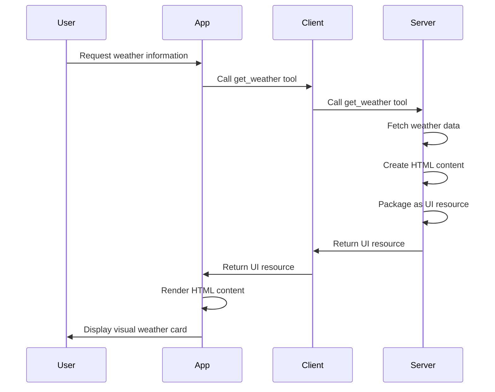

# Simple

<EpicVideo url="https://www.epicai.pro/workshops/day-5-6-mcp-ui/intro-to-simple-acds4" />

MCP UI enables servers to send rich, interactive user interfaces along with their responses, transforming AI chat from text-only interactions into visually engaging experiences. Instead of just returning plain text, your MCP server can now provide HTML content that clients can render as actual UI components.

This capability opens up entirely new possibilities for AI applications. Instead of describing a chart or form, you can actually show one. Instead of listing data in text format, you can present it in a beautiful, interactive interface.

Example:

```ts
import { createUIResource } from '@mcp-ui/server'

// Create a UI resource with raw HTML
const resource = createUIResource({
	uri: 'ui://weather-card/lagos-nigeria',
	content: {
		type: 'rawHtml',
		htmlString: `
			<div style="padding: 20px; border: 1px solid #ccc; border-radius: 8px; background: linear-gradient(135deg, #74b9ff, #0984e3); color: white;">
				<h1>Lagos, Nigeria</h1>
				<p>85°F - Partly Cloudy</p>
				<p>Humidity: 78% | Wind: 12 mph</p>
			</div>
		`,
	},
	encoding: 'text',
})
```

<callout-info>
	The `createUIResource` function is the foundation of MCP UI. It takes your
	HTML content and packages it into a format that MCP clients can understand and
	render. The `uri` parameter creates a unique identifier for your UI resource,
	while the `content` specifies what type of UI you're providing.
</callout-info>

Here's how this works in practice. When an AI assistant needs to show weather information, instead of returning plain text like "Lagos, Nigeria: 85°F, Partly Cloudy, Humidity: 78%", it can return a UI resource that renders as an actual visual weather card with proper styling and structure.

The MCP UI specification defines several content types, but we'll start with the simplest: `rawHtml`. This allows you to send any HTML string that will be rendered directly by the client. This is perfect for static content, simple layouts, and getting started with UI in MCP.

<callout-success>
	From [the MCP UI
	documentation](https://mcpui.dev/guide/server/typescript/usage-examples#metadata-configuration-examples):
	Raw HTML content is delivered as `text/html` MIME type and can include any
	valid HTML markup, making it ideal for simple UI components and static content
	display.
</callout-success>

Here's a sequence diagram showing how UI resources flow through the MCP system:



In this exercise, you'll implement a tool that returns a UI resource instead of plain text. You'll learn how to:

- Import and use the `createUIResource` function from `@mcp-ui/server`
- Create HTML content that displays data in a structured, visual way
- Handle error cases (like missing data) with appropriate UI feedback
- Package your HTML as a proper MCP UI resource

The key difference from regular MCP tools is that instead of returning text content, you'll return a UI resource that clients can render as actual visual components. This transforms the user experience from reading text descriptions to interacting with rich, visual interfaces.

- 📜 [MCP UI Server Documentation](https://mcpui.dev/guide/server/typescript/usage-examples#metadata-configuration-examples)
