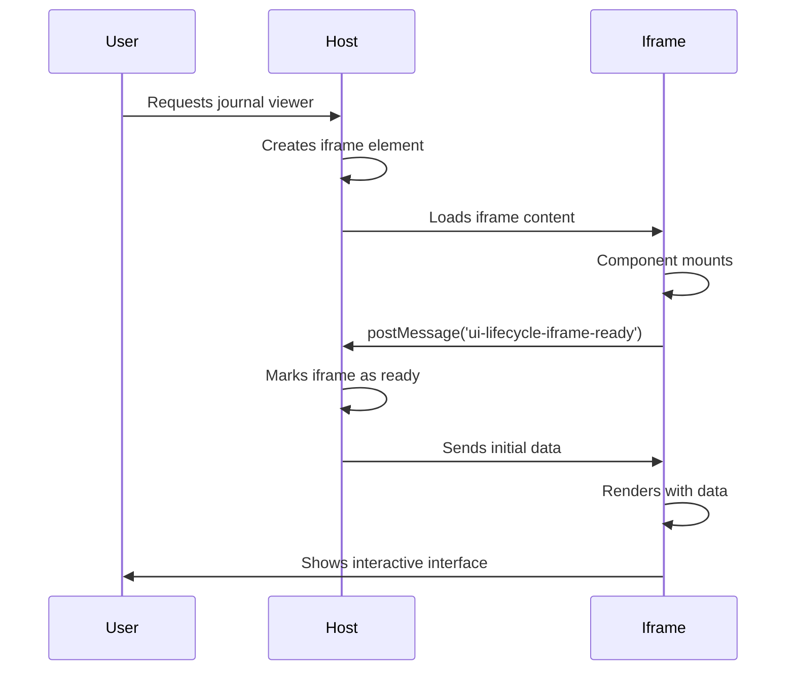

# Ready

<EpicVideo url="https://www.epicai.pro/workshops/day-5-6-mcp-ui/ready-5t7rk" />

👨‍💼 When iframes load in AI chat, the host application doesn't know when they're ready to receive data or handle interactions. Without this handshake, users see broken interfaces or endless loading states.

```tsx
// Notify the host that the iframe is ready
useEffect(() => {
	window.parent.postMessage({ type: 'ui-lifecycle-iframe-ready' }, '*')
}, [])
```

The `ui-lifecycle-iframe-ready` message tells the host that the iframe has loaded and is ready for communication. This enables the host to send initial data and makes interactions work properly.



<callout-warning class="important">
	Always send the ready message as soon as the component mounts. Delaying this
	message means the host application will wait indefinitely.
</callout-warning>

<callout-muted>
	📜 For more details on the MCP UI lifecycle protocol, see the [MCP UI
	Embeddable UI documentation](https://mcpui.dev/guide/embeddable-ui).
</callout-muted>

Now, implement the lifecycle communication to make your iframe ready for interaction!
