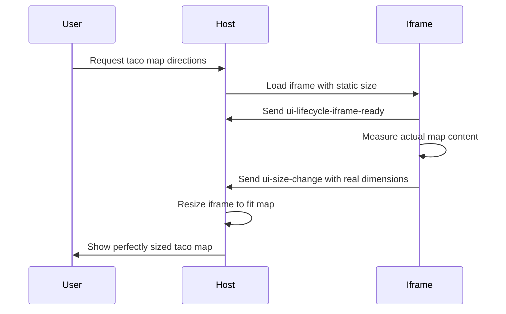

# Dynamic Sizing

👨‍💼 Users expect iframes to fit their content perfectly, not waste space or require scrolling. The journal viewer should automatically adjust to show exactly what's needed.

```tsx
const height = document.documentElement.scrollHeight
const width = document.documentElement.scrollWidth

window.parent.postMessage(
	{
		type: 'ui-size-change',
		payload: { height, width },
	},
	'*',
)
```

Use `scrollHeight` and `scrollWidth` to measure the full content dimensions, then send a `ui-size-change` message to the parent window so it can resize the iframe accordingly.

The static `preferred-frame-size` from the previous exercise works for fixed layouts, but journal entries have varying content lengths. A short entry wastes space, while a long entry gets cut off.

<callout-warning>
	Just make sure you utilize scrolled elements to avoid requesting a ton of
	height or width with a lot of content.
</callout-warning>



<callout-info>
	Measure after the component renders to get accurate dimensions. This typically
	happens so fast the user won't notice.
</callout-info>

Now implement the size measurement to make the journal viewer fit perfectly.

💰 I'll be in the instructions a bit because this isn't a React workshop, so if
you're unfamiliar with React, don't worry.
