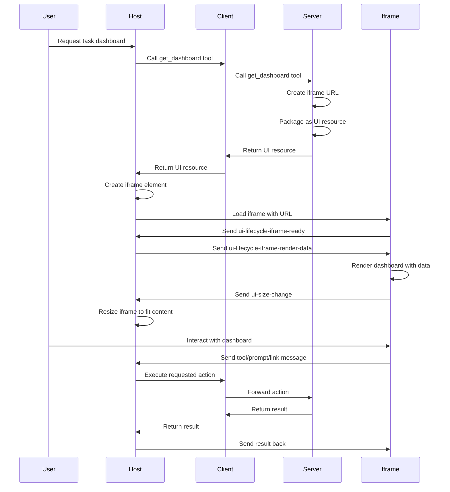

# Complex

While raw HTML and Remote DOM provide great ways to create UI components, they have limitations when it comes to building truly complex, interactive applications. Raw HTML requires you to write all styling from scratch, and Remote DOM, while consistent, can be cumbersome for complex layouts and interactions. For sophisticated applications that need rich functionality, responsive design, and complex state management, you need a more powerful approach.

The solution is **iframe-based UI components** - embedding full web applications (though normally just widgets rather than fully routed solutions) as UI resources in MCP. This approach lets you leverage entire frameworks like React, Vue, or any other web technology to create rich, interactive interfaces that can communicate with the host application through a standardized protocol.

Example:

```ts
import { createUIResource } from '@mcp-ui/server'

// Create a UI resource with an iframe for a task management widget
const resource = createUIResource({
	uri: `ui://task-dashboard/${Date.now()}`,
	content: {
		type: 'externalUrl',
		iframeUrl: 'https://example.com/widgets/task-dashboard',
	},
	encoding: 'text',
	uiMetadata: {
		'preferred-frame-size': ['1200px', '800px'],
	},
})
```

<callout-info>
	Iframe-based UI components use the `externalUrl` content type to embed full
	web applications. The `uiMetadata` allows you to specify preferred sizing for
	the iframe, giving the host application hints about optimal dimensions.
</callout-info>

Here's how this works in practice. When an AI assistant needs to show a complex journal viewer with interactive features like deleting entries, viewing details, and summarizing content, instead of trying to build this with raw HTML or Remote DOM, it can embed a full React application that handles all the complexity.

The iframe approach provides several key advantages:

1. **Full Framework Support**: Use any web framework. If it can serve a web page, it can be embedded in an iframe.
2. **Complex State Management**: Handle sophisticated application state with libraries like Redux, Zustand, or Context
3. **Rich Interactions**: Build complex user interactions with full access to browser APIs
4. **Responsive Design**: Leverage CSS frameworks and responsive design patterns
5. **Communication Protocol**: Standardized `postMessage` API for iframe-to-host communication

<callout-success>
	From [the MCP UI embeddable UI
	documentation](https://mcpui.dev/guide/embeddable-ui): Iframe-based UI
	components communicate with the parent window via `postMessage`, enabling rich
	interactions while maintaining security boundaries between the iframe and host
	application.
</callout-success>

The communication protocol between iframe and host follows a standardized message structure:

```typescript
type Message = {
	type: string
	messageId?: string // optional, used for tracking the message
	payload: Record<string, unknown>
}
```

Key message types include:

- `ui-lifecycle-iframe-ready` - Notify host that iframe is ready to receive messages
- `ui-size-change` - Inform host when iframe dimensions change
- `tool` - Request host to execute an MCP tool
- `prompt` - Request host to send a prompt to the AI
- `link` - Request host to navigate to a URL

There are other message types, but they typically require specific server-client integration and are out of scope for this workshop.

Here's a sequence diagram showing how iframe-based UI components work:



In this exercise, you'll implement a sophisticated journal viewer using iframe-based UI components. You'll learn how to:

- Create iframe-based UI resources using the `externalUrl` content type
- Set up proper communication between iframe and host using `postMessage`
- Handle iframe lifecycle events like ready state and size changes
- Implement responsive iframe sizing that adapts to content
- Build complex interactive features within the iframe

The key difference from previous approaches is that instead of creating simple UI components, you're building full web applications that can leverage the entire ecosystem of web technologies while maintaining secure communication with the host application.

<callout-success>
	It's important to note that you **can** perform interactive operations with
	the rawHtml or remoteDom contet types, but maintaining that can be cumbersome
	and error prone.
</callout-success>

<callout-warning>
	Iframe-based UI components are more complex to implement than raw HTML or
	Remote DOM, but they provide the flexibility and power needed for
	sophisticated applications. The communication protocol adds complexity but
	enables rich interactions between the iframe and host application.
</callout-warning>

- 📜 [MCP UI Embeddable UI Documentation](https://mcpui.dev/guide/embeddable-ui)
