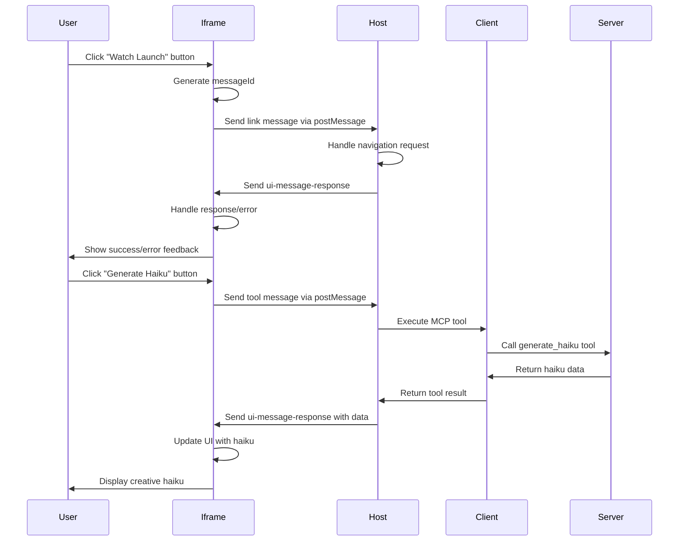

# Interactive

While iframe-based UI components provide rich, visual interfaces, they need a way to communicate back to the host application to trigger actions, request data, or request links be opened. Without this communication, iframes would be isolated islands that can't integrate with the broader application ecosystem.

The solution is the **MCP UI communication protocol** - a standardized way for iframe-based UI components to send messages to their host application using the `postMessage` API. This enables rich interactions like calling MCP tools, sending prompts to AI assistants, navigating to external links, and requesting data from the host.

Example:

```ts
// Send a link navigation request to the host
await sendLinkMcpMessage('https://www.example.com/snowboarding/')

// Call an MCP tool from within the iframe
await sendMcpMessage(
	'tool',
	{
		toolName: 'generate_haiku',
		params: { theme: 'quantum computing', mood: 'playful' },
	},
	{ signal: unmountSignal },
)

// Send a prompt to the AI assistant
await sendMcpMessage(
	'prompt',
	{
		prompt:
			'Create a recipe for a fusion dish combining Japanese and Mexican cuisine',
	},
	{ signal: unmountSignal },
)
```

<callout-info>
	The MCP UI communication protocol uses `postMessage` to enable secure,
	bidirectional communication between iframe-based UI components and their host
	application. This allows iframes to trigger actions in the host while
	maintaining security boundaries.
</callout-info>

Here's how this works in practice. When a user clicks a "Watch Launch" button in your space exploration dashboard iframe, instead of opening a new tab or trying to navigate directly, the iframe sends a `link` message to the host application. The host then handles the navigation, ensuring it follows the application's routing and security policies.

The communication protocol supports several key message types:

1. **`link`** - Request host to navigate to a URL
2. **`tool`** - Request host to execute an MCP tool
3. **`prompt`** - Request host to send a prompt to the AI assistant
4. **`intent`** - Express user intent for the host to act upon
5. **`notify`** - Notify host of side effects from user interactions

<callout-info>
	`intent` and `notify` are not used in this exercise as they are not relevant
	for general use AI agent apps and typically require specific server-client
	integration.
</callout-info>

The message structure follows a consistent pattern:

```typescript
type Message = {
	type: string
	messageId?: string // optional, used for tracking the message
	payload: Record<string, unknown>
}
```

Here's a sequence diagram showing how interactive communication works:



In this exercise, you'll implement interactive communication in your iframe-based UI components. You'll learn how to:

- Send `link` messages to request host navigation to external URLs
- Send `tool` messages to execute MCP tools from within the iframe
- Send `prompt` messages to interact with AI assistants
- Handle asynchronous responses and errors properly
- Implement proper cleanup with AbortSignal

The key difference from previous exercises is that instead of just displaying data, your iframe now actively communicates with the host application to trigger actions, making it a truly interactive component that integrates seamlessly with the broader application ecosystem.

- 📜 [MCP UI Embeddable UI Documentation](https://mcpui.dev/guide/embeddable-ui)
