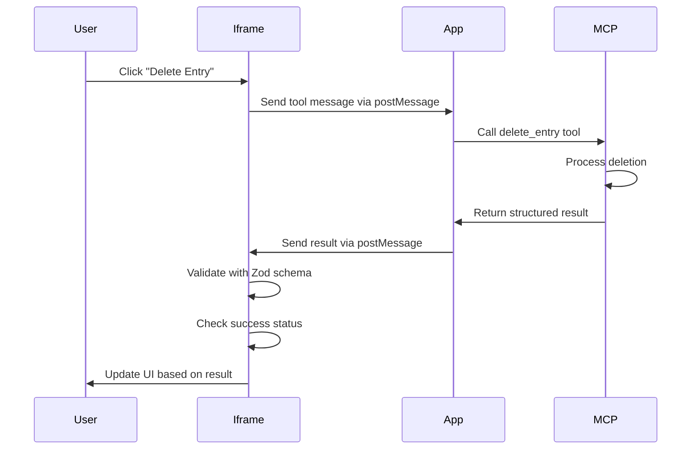

# Tool Results

<EpicVideo url="https://www.epicai.pro/workshops/day-5-6-mcp-ui/tool-results-18put" />

👨‍💼 When users interact with our journal entries, they expect immediate feedback and reliable actions. If a user deletes an entry, they need to know it actually worked - not just hope for the best. The problem is: how do we get structured, validated data back from our MCP tools so we can build intelligent workflows that respond appropriately to different outcomes?

```ts
// Tool returns both human-readable and structured data
const result = await sendMcpMessage(
	'tool',
	{
		toolName: 'analyze_code',
		params: { filePath: 'src/utils/validation.ts' },
	},
	{ schema: codeAnalysisSchema },
)

// Client can access structured data and respond intelligently
const { metrics, suggestions, complexity } = result.structuredContent
if (complexity > 10) {
	showRefactorWarning(suggestions)
}
updateCodeMetrics(metrics)
```

To make this happen, we use Zod schemas to validate and type the structured content returned by MCP tools. This enables rich integrations where the client can understand and act on tool results programmatically, rather than requiring manual user intervention for every step.

The structured content is defined by the tool's `outputSchema` and validated using Zod schemas on the client side, ensuring type safety and reliable data flow between the MCP server and client applications.

<callout-info>
	With structured content, MCP clients can build sophisticated workflows where
	tools can trigger automatic actions based on their results, creating a more
	intelligent and responsive user experience.
</callout-info>



The goal is to make tool interactions feel intelligent and responsive, so users can trust that their actions have real consequences and get immediate, accurate feedback about what happened.

Remember, our `delete_entry` tool returns structured content with a `success` boolean. You'll need to create a Zod schema to validate this data and use it in your `sendMcpMessage` call to get type-safe access to the result!

👨‍💼 Thanks Kellie!

Now, start by creating the schema, implement the tool call, and handle both success and failure cases to make your journal deletion feel reliable and responsive.
